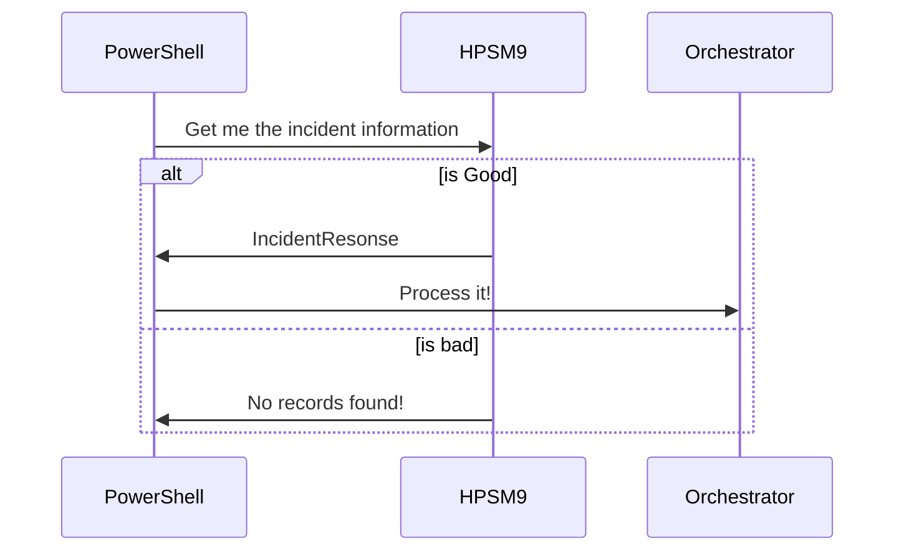

# PSHPSM9
A repository for sharing PowerShell codes to automate HPSM9. Please check the HPSM web service documentation [here](https://community.softwaregrp.com/dcvta86296/attachments/dcvta86296/itrc-695/16512/1/hp_man_SM9.33_WebServices_pdf.pdf)

### List of available cmdlets

- [x] `Get-HPSM9IncidentRequest`
- [x] `Get-HPSM9ChangeRequest`
- [ ] `Get-HPSM9ProblemRequest`
- [x] `Get-HPSM9DeviceInformation`
- [ ] `Register-HPSM9IncidentRequest`
- [ ] `Approve-HPSM9ChangeRequest`
- [ ] `Close-HPSM9IncidentRequest`

> We are working on the web service proxy object to find the methods dynamically before invoking it!

### Incident Management Blue Print

### Disclaimer
This module is built on the fly based on the request from the Incident, Change, Problem and Configuration management team. All the shared scripts are packaged as module. So, possible mistakes are expected.